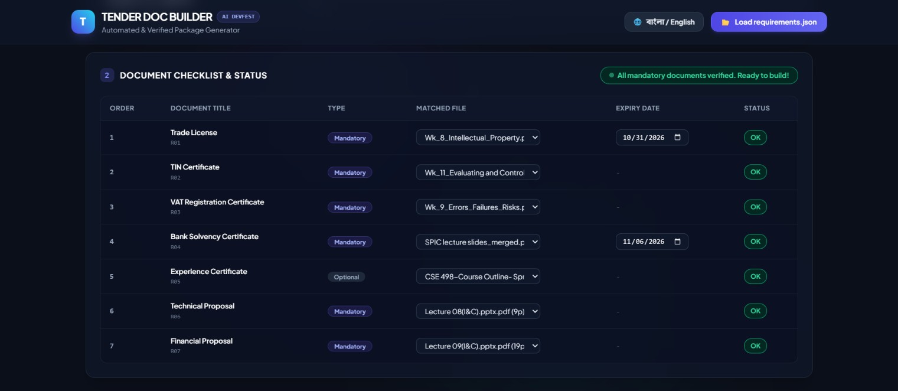
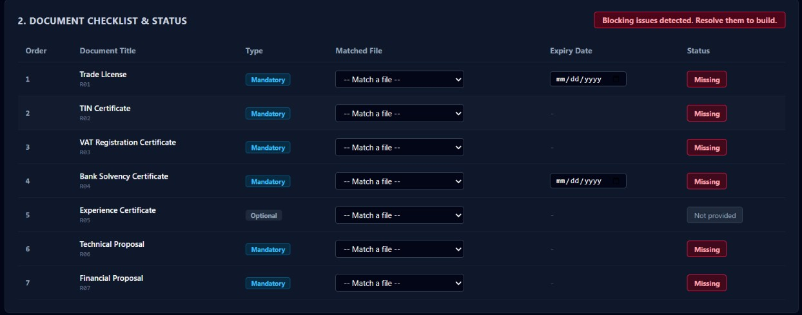

# Tender Document Package Builder

### AI DevFest 2026 - Solo Vibe Coding Contest
- Participant Name: Md. Muhaiminul Islam Hasin
- Registration Number: 232-15-667
- Institution: Daffodil International University
- Repository: https://github.com/m35hasinoob/devfest-232-15-667
- Live Demo Link: https://m35hasinoob.github.io/devfest-232-15-667/

---

## 1. Project Overview
A fully client-side, browser-based web application that automates the verification, deduplication, and compilation of tender document packages according to official requirements.

---

## 2. Visual Document Verification & Checklist

### Document Verification Status:

### Initial Document Checklist:

---

## 3. Implemented Features
- JSON Schema Validation: Dynamically loads and parses requirements.json to configure tender details and document requirements sorted by order.
- Multiple PDF Upload & Page Counting: Evaluates document structure and counts total pages using client-side PDF-Lib. Rejects non-PDF files safely.
- Exact Content Duplication Detection: Uses SHA-256 cryptographic hashing to detect duplicate PDF files regardless of filenames and blocks duplicate assignment.
- Dynamic Matching & Expiry Verification: Real-time evaluation of document statuses (OK, Missing, Expiry date needed, Expired, Not provided). Expiry is checked against submission deadlines.
- Bilingual Interface: Full instantaneous switching between English and Bangla across all UI elements, labels, and status badges.
- PDF Compilation & Standards: Generates a single compiled PDF (<tender_id>_Package.pdf) containing:
  - English Cover Page with metadata and ordered document index.
  - Sequentially merged pages of all provided documents.
  - Centered footer on all pages: <tender_id> | Page X of Y.

---

## 4. How to Run Locally
1. Clone the repository: git clone https://github.com/m35hasinoob/devfest-232-15-667.git
2. Open index.html directly in Google Chrome. No backend or server setup is required.

---

## 5. AI Usage
- AI Tools Used: Google Gemini
- Most Useful Prompt: Create a client-side tender package builder in HTML and Tailwind CSS using PDF-Lib that validates requirements.json, performs SHA-256 duplicate detection, dynamically calculates document expiry statuses against submission deadlines, toggles between English and Bangla, and merges PDFs with an official cover page and dynamic page-counter footers.

---

## 6. License
MIT License